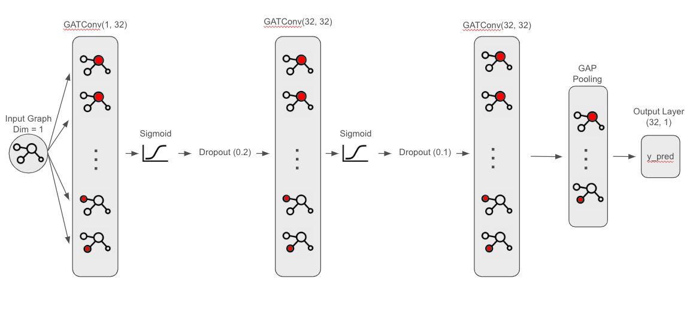
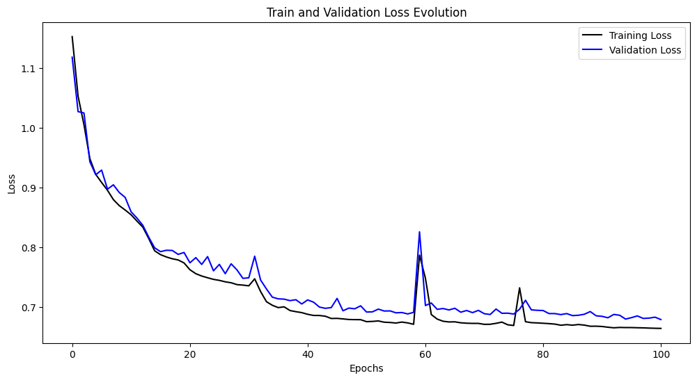
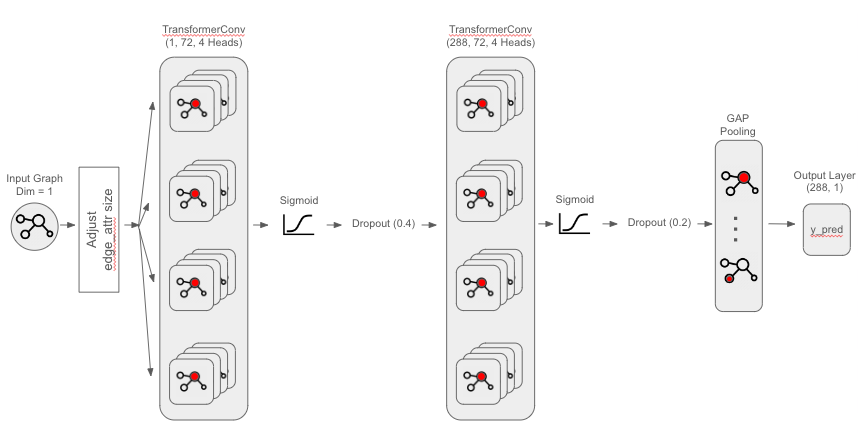
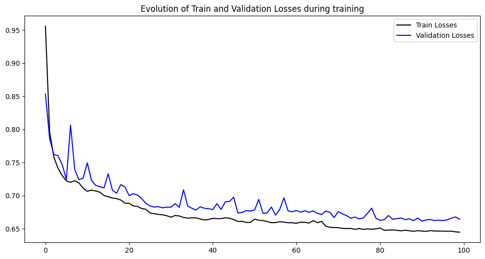

# Graph Neural Networks - Comprehensive Report
*Théo Bacqueyrisse*

## Introduction
In this project, I will first try to understand the theory behind Graphs and their use with Neural Networks. Then, in a second part, I will detail the approach used in order to make Graph Level predictions applied to Molecules Data. Finally, in a third part, I will introduce the work that has been done to implement a Graph Transformer from scratch. 

## I - Graph Neural Network Theory

### 1 - What is a Graph ?

A **Graph** can be defined as a Data Structure where elements have nodes, and edges linking nodes between them. 

→ For example, when speaking about molecules, that can be represented with a Graph Structure, the nodes are the atoms of the modecule, and the edges are the chemical bonds linking atoms together.

Graphs are particularly useful to deal with complex interactions between particular entities, and they are widely used with social relations, text and image analysis for example.

Here are a few examples of Graphs that could be used to solve Data Science problematics.

  
  

  
  

From each of these images, we can deduce a Graph Structure made of Nodes and Edges to link them. For the bottom left image, even if it is not straight forward, we could link the two people by a link of type *Human*, and link the two cars with a *vehicle* link for example.

### 2 - What kind of Predictions ?

Graph Data can be used for 3 particular types of prediction tasks : 

#### *2a - Node Level Predictions* : 

It is possible to predict a missing node label from its relations with other nodes. As a straight forward example, a Carbon Dioxyde Molecule has the following Graph Structure : 

Now imagine that the right hand side atom of this molecule was unknown. Then, by basic Chemistry knowledge, we can say that this atom is an Oxygen atom, as it has a double chemical bond with the Carbon atom next to it. Learning relations between nodes, the type and attributes of edges that connect them can thus help predicting a Node label.

#### *2b - Link Predictions*

Another possible task to perform is to predict if there is a link between two nodes, and also possibly predict the type of link that links them.

This type of task is very useful for social interaction analysis. Imagine we are considering social relationships between a group of people, but we do not know if two people are actually linked by, let us say, a *friendship* edge.

Then, by analysing the graph as a whole, we can make predictions about whether or not these two people are linked. Indeed, if we see that other people are linked to both of them as friends, we could think that the two people have good chances of being friends as well. 

This type of prediction can have amazing value nowadays with the role that play social media and virtual social interactions in our society.

#### *2c - Graph Level Predictions*

This type of predictions is when you wan to predict a characteristic, or a number for example, by looking at a whole known graph, its interactions and properties. For example, when dealing with Recommendation System, you can find yourself with a graph like this : 

From this clients file represented as a Graph, you can for example decide to send a promotionnal e-mail to these clients based on their preferences.

As such, Graphs can be a valuable Data Structure for many domains, and the potential of predictions has been increasing sharply with the development of Deep Learning algorithms.

In this project, we will focus on a Graph Level Prediction task.

### 3 - Neural Network Theory

#### *3a - Data Specificities*

When using Graph Data, it is important to understand the particular nature of this type of data. Besides the basic structure of a graph (nodes, edges, ...) that we discussed above, here are the specificities that make them different from classical data structures.

- First, every observation in a Graph Dataset can be of different shape and size.
Indeed, molecules for example do not contain the same number of nodes and edges. It does not prevent to analyze and predict the same feature for those graphs. 

- A Graph is also hard to vizualize, as it does not exists in a classical euclidian 2D or 3D space. However, some Python libraries allow to get 2D or 3D representations through dimensionality reduction for example. 

- A Graph also have an infinite possibility of visual representations. Indeed, two different visual representations of a graph containing identical nodes, edges and relations, but differently displayed, refer to a unique Graph observation. We will see an example of this later.

- Increasing the dimension, size and complexity of a Graph can make the analysis very hard to interpret for a human eye.

- A major concept in graph analysis is the Neigborhood, as every node are influenced by their neighborhood nodes and the relation between them. Consider the local structures alongside the global structure is key to obtain a good analysis. The information on the neigborhood of each node can be obtained by transforming the input graph from its general form to a form where each node has a value from a function that takes as input the node itself and its neighborhood. Here is an example, where $X_{Nb}$ is the set of nodes connected to the node $X_b$ : 

- Then, when considering a set of nodes $(X_1, ..., X_n)$, we induce a node ordering, that we do not wish to impact the neural network prediction. That is, we would like the output to be equivalent for every permutation between nodes. This is called permutation invariance, which is very important to have for graph level predictions which will be our task. We verify this property by finding a prediction function that yields, for every existing perumtation $p$ :

$$
f(p(X)) = f(X)
$$

- In theory, when we consider the edges between the nodes of a graph, we could actually represent our graph in a matrix form, called the adjacency matrix. This type of matrix is a $(n * n)$ matrix, with $n$ being the number of nodes of the graph, and each element of the matrix is the type of edge existing between two nodes, depending if they interact between each other or not. Here is an example of an adjacency matrix representation, with an H2O molecule :

$$
\begin{bmatrix}
0 & 1 & 0 \\
1 & 0 & 1 \\
0 & 1 & 0 \\
\end{bmatrix}
$$

However, with the classical types of layers used in Graph Neural Networks that we will describe later, the layers do not take the actual adjacency matrix as input 

In summary, a Graph is a singular type of data that needs to be well understood to best adapt the analysis to the taks that is to be performed. Let us now see what are the types of GNN layers, and how they work.

#### *3b - Different types of GNN layers*

When creating a Graph Neural Network, one must choose the type of layers to use to realize the desired task. In general, classical types of layers are Graph Convolutionnal layers, Graph Attentional layers, and Graph Message Passing layers. They differ in the way they diffuse the neigborhood message, so the way that we go from image 1 to image 2 on the above explanation of Neighborhood. These layers are thus the functions taking as parameters the node itself and its neigborhood and send the value $h_i$ that we see on the above image. The way they differ is the weights given to the neighborhood information.

- First, Graph Convolutionnal layers take fixed weights determined by the neigborhood nodes and edges. Here is an illustration, where each node $i$ sends a fixed weight $c_{bi}$ :

Here, the value given to the the node by the layer is given by the following function : 

$$
h_i = φ(x_i, v_j(c_{ji} * ψ(x_j)))
$$

The $φ$ and $ψ$ operators being activation functions, such as sigmoid or ReLU. The $v$ operator is permutation-invariant aggregator, allowing to sum up the neigboorhood information (from every neighborhood node) in one number.

- Then, Graph Attentionnal layers take as weights from the attention given to each part of the neighborhood. Attention in deep learning refers to the process of giving higher importance to some parts of the input compared to other parts. In fact, the weights applied to the nodes are computed from the relation between the 'central' node and its neighbor, so that the kind of relation actually matters. Here is an illustration to sum it up : 

So that the value given to each node differs only with the weights used, that are functions of two nodes now :

$$
h_i = φ(x_i, v_j(α(x_i, x_j) * ψ(x_j)))
$$

- Another type of layer is Message Passing layer, where 'message' vectors replace the multiplication of weights and an activated value of the neighborhood node, like the following : 

The value set at each node is 

$$
h_i = φ(x_i, v_j(ψ(X_i, X_j)))
$$

Here, we have $m_{ji} = ψ(X_i, X_j)$. The difference with attention layers is that ony the values $m_{ji}$ are used to compute $h_i$, and they are not just weights like with other layers.

There are many different layers available in the *PyTorch Geometric* package, and for this project, during the first phase of Graph Neural Network implementation, we will use Graph Attention layers in the architecture of the model. 

#### *3c - Pooling layers*

Finally, an inportant part of Graph Neural Network is Graph Pooling, especially for Graph Level tasks as we need to have a global representation of the graph. The principle of pooling is to reduce the size of the graph to obtain a small representation, while keeping essential information about the graph and neigborhoods of nodes. Here is an illustration of this process : 

The same concept exists in classic convolutionnal networks for images. It consists in an additionnal layer in the network after the GNN layers that we presented earlier, where sets of nodes and edges will be summarized in a subset of nodes and edges. There are many types of pooling layers, but here are some regular pooling layers often used : 
 
- Global Average Pooling, where the average value of a set of nodes is taken to create a single value for this set. 

- Global Max Pooling, where the maximal value of a set is taken instead of the average.

- Global Add Pooling, where the sum of a set of nodes is taken.

For out Graph Neural Network, we will use a Global Average Pooling layer.

## II - Graph Neural Network Implementation

### 1 - Data and Kind of Predictions

We will work in this project with the ZINC open-source dataset. It contains a collection of 249,456 graph representations of comercially availaible chemical compounds. Using the PyTorch Gemoetric package enable us to download the preprocessed data already split into train, validation and test samples. 

- 220,011 observations for the Train Set
- 24,445 observations in the Validation Set 
- 5,000 observations in the Test Set

The data is structured with :

- A variable $x$, which is the atom type contained in the graph. A dictionnary of the atoms is available in the raw ZINC dataset. For example, 0 refers to Carbon atoms, and 1 to Oxygen.
- A variable $edge index$, to indicate the connections between nodes. It takes values such as [1, 5] and [5, 1] to signify that nodes 1 and 5 have a bond to connect them.
- A variable $edge attr$, which contains the type of bond (edge) between two nodes. The dictionnary of these bonds is also available in the raw ZINC data. This variable takes values 1, 2 and 3 for single, double and triple bonds.
- A variable $y$, which is our **target** variable, and measures the constrained solubility of the molecules. 

→ The constrained solubility of a molecule is given by the following formula : 

$$
y = log(P) - SAS - Cycles
$$

with : 

- $log(P)$ being the logarithm of the water-octanol partition coefficient. This quantity is itself a measure of the relationship between fat solubility and water solubility of the molecule. 

- $SAS$ is the Synthetic Accessibility Score, which measures how difficult a particular molecule is to synthesize.

- $Cycles$ is the number of cyles with more than 6 atoms in the molecule.

The constrained solubility is usually used as an indicator of solubility of the molecule, and a measure of how drug-like a molecule is. Our task will be to predict this property using Graph Neural Networks.

You can find a general Data Exploration here : [Data_Exploration.ipynb](Data_Exploration.ipynb)

Here are two boxplots showing the distribution of our target variable, the second one not displaying extreme values in the data :

We can see that the majority of the graphs take values between -4 and 4. However, there is a subsequent number of outliers taking extremely low values below -20. For the training phase, we removed from the data the graphs with values under -10 for generalization purposes.

Then, using the package *networkx*, we are able to obtain a visual representation of our molecule graphs : 

We can clearly see the structure of our molecule, with its nodes and edges.

An interesting thing to see with these vizualisitations is the  variability of the representation for a same graph, like in the following example : 

If you look closely, you can see that these two plots show the exact same graph, with the same number of nodes and identical edges. However, the representation is completely different. This illustrates the visual representations of graphs property that we talked about above.

In summary, we are going to try to predict a chemical compound property of molecules from the ZINC dataset, which constitutes a Graph-Level prediction task.

### 2 - Network Architecture

For the architecture of our neural network, I used :

- **Graph Attentionnal layers**, as they showed more promising results on a small number of epochs during training. We use the GATConv layer from the PyTorch Geometric package, where the attention mechanism values $\alpha_{i,j}$ are computed by the following formula :

$$
\alpha_{i,j} = \frac{exp(LeakyReLU(a^T[W_{h_i} \mid\mid W_{h_j}]))}{\sum_{k \in N_i} exp(LeakyReLU(a^T[W_{h_i} \mid\mid W_{h_j}]))}
$$

Here, $a$ is a weight vector, and as we discussed previously, the $j$ nodes are the nodes in the neigborhood $N_i$ of $X_i$, and $W$ are weights matrices applied to these nodes. 

To recall, the $LeakyReLU$ formula is : 

$$
LeakyRelu(z) = 
\begin{cases}
    0.01 z & \text{if} & z < 0 \\
    z & \text{if } & z \geq 0
\end{cases}
$$

- **3 hidden layers**. Indeed, it is important in Graph Neural Networks not to take too many layers, and choose the smallest number of layers possible, while capturing as much information as possible. After having tried 2 and 3 layers, I kept 3 layers that showed better results.

- A classic **Linear** output layer to get the predicted result.

- A **Global Average Pooling** as pooling layer, taking the formula :

$$
r_i = \frac{1}{N_i} \sum_{n=1}^{N_i} x_n
$$

- The **Sigmoid** as activation function between layers, that proved to be more efficient compared to other functions like ReLU or Tanh, given by the following formula :

$$
sigmoid(z) = \frac{1}{1 + e^{-z}}
$$

- An **Embedding Size** of 32, meaning that the first layer will have a 32 element output dimension, and the output layer will have 32 elements as input dimension. I chose 32 as a representative general number of nodes in the molecules in the data.

- **Dropout** after the first and second layer as regularisation technique, to avoid possible overfitting, with probability 0.2 and 0.1 respectively. This phase takes the proportion given in random input elements, and sets their values to 0. 

Here is the scheme of the Network I used : 

For the configuration of the Training phase :

- Model on **100** epochs.

- **64** graphs per data batch. This means that for a given epoch, the training will go through the set of batches, composed of 64 graphs each (less for the last batch possibly), and make predictions for this batch and compute the loss for this batch. We thus have :

    - 3433 batches in the Train Set
    - 382 batches in the Validation Set
    - 79 batches in the Test Set

- **L1 loss** function, so the Mean Absolute Error of prediction, defined by : 

$$
MAE(y_{pred}, y) = \frac{1}{n} \sum_{i = 1}^n \vert y_{i}^{pred} - y_i \vert 
$$

- **Adam** Optimizer, with *learning_rate* = 0.003.

- **ReduceLROnPlateau** Scheduler from this optimizer, to ajust the learning rate during training. This scheduler will lower the learning rate during training if a chosen metric stops inproving at a certain epoch. In this case, I chose the Validation Loss as metric, so that if it does not improve between 10 epochs, the learning rate will be lowered to affine training and optimize the results.

- The training was done in a Google Colab notebook, to be able to use the NVIDIA Tesla T4 free **GPU** of a Colab notebook and accelerate the training phase.

#### Results of the GNN :

- Final training loss of **0.6640**
- Final validation loss of **0.6788**
- Test loss of **0.6773**

Here is the evolution of the losses during training : 

We see that we managed to avoid any overfiting of the data since training and validation losses remain close to each other. Also, we note that the improvement was important at the beginning of the process, and it became quite slow from 40 epochs.

The training phase took around 45 minutes to complete, using the colab GPU.

You can find the work that has been done with this GNN architecture here : [GNN.ipynb](GNN.ipynb)

## III - Graph Transformer Implementation

### 1 - Transformer principle with Graphs

The use of the Transformer architecture applied to the field of Graphs analysis has been introduced in 2019 by [Yun et. al](https://proceedings.neurips.cc/paper_files/paper/2019/file/9d63484abb477c97640154d40595a3bb-Paper.pdf). They applied it to a graph generation and node classification task.

The Transformer will use message passing like with GNN to obtain information from nodes and their neigborhoods as it is crucial is Graph analysis. However, the way that the message is passed can differ from GNN architecture.

The Transformer architecture relies primarly on self attention mechanisms, that lead the model to focus specifically on several parts of the data, and assign importance weights to these parts of the data.

There are different kinds of attention mechanisms, but we will focus on the Multi-Head attention mechanism for this project that is very common for a Transformer architecture.

The goal of Multi-Head Attention is to compute attention multiple times in parallel using a certain number of Weights matrices, that is the number of Heads to be chosen. These matrices are learnable parameters in the same way than with a classical Transformer architecture.

Each head focuses on different parts of the data, allowing the model to capture different relationships simultaneously.

Like with the GNN, a Graph Transformer can contain a pooling layer to reduce the size of a graph while still containing important information.

### 2 - Network Architecture

Since, in addition of implementing a Transformer, we would like to compare the results with the GNN model, we chose to use parameters quite similar to the GNN architecture. We thus have :

- **TransformerConv** layers from the package *PyTorch Geometric*, where data is updated in the following way : 

$$
x_i' = W_1 x_1 + \sum_{i \in N_i}  \alpha_{i,j} W_2 x_j
$$

with $N_i$ again the neighborhood of node i, and $\alpha_{i,j}$ computed as : 

$$
\alpha_{i,j} = softmax(\frac{(W_3 x_i)^T (W_4 x_j)}{\sqrt d})
$$

In these equations, $W$ refers to weights matrices mentionned above, with here 4 heads in the mechanism.

The softmax formula is : 

$$
softmax(z_i) = \frac{e^{z_i}}{\sum_{j=1}^{N} e^{z_j}}
$$

- **2** hidden TransformerConv layers, to once again try to capture as much information as possible with as few layers as possible.

- **4 heads** for each TransformerConv layer.

- A classic **Linear** output layer to get the predicted result.

- A **Global Average Pooling** as pooling layer, taking the formula :

$$
r_i = \frac{1}{N_i} \sum_{n=1}^{N_i} x_n
$$

- The **Sigmoid** as activation function between layers, that proved to be more efficient compared to other functions like ReLU or Tanh, given by the following formula :

$$
sigmoid(z) = \frac{1}{1 + e^{-z}}
$$

- An **Embedding Size** of 72. Choosing this value has been the trick in this process, as it appears that TransformerConv does not support input graphs of different dimensions. The choice of 72 comes from the dimension of the $edgeattr$ variable from the first graph in my data. In fact, the dimension of $edgeattr$ is necessarly twice the number of nodes in a graph as we consider every nodes two-by-two.

I thus had to, first choose an embedding size, 72, and then apply this size to every input graph. So if a graph had less than 36 nodes, so a dimension of $edgeattr$ lower than 72, I reashaped it adding 'virtual' edges attributes. If on the contrary it had a dimension of $edgeattr$ higher than 72, I only selected the first 72 values and dropped the other. This process probably limits the performance that the model can attain, and I am considering using another kind of Transformer layer as a next step of the project that is suitable for differently sized input graphs. 

- **Dropout** after the first and second layer as regularisation technique, to avoid possible overfitting, with probability 0.4 and 0.2 respectively. This phase takes the proportion given in random input elements, and sets their values to 0. 

Here is a schema of the created network, with the use of different heads illustrated.

At each TransformerConv layer, there are 4 sets of 72 elements computed, because we chose to use 4 heads.

For the configuration of the Training phase, the same parameters than with the GNN were used so :

- **100** epochs.

- **64** graphs per data batch.

- **L1 loss** function.

- **Adam** Optimizer, with *learning_rate* = 0.003.

- **ReduceLROnPlateau** 

- The training was done in a Google Colab notebook, to be able to use the NVIDIA Tesla T4 free **GPU** of a Colab notebook and accelerate the training phase.

#### Results of the Transformer :

- Final training loss of **0.6446**
- Final validation loss of **0.6642**
- Test loss of **0.6769**

Here is the evolution of the losses during training : 

Here also, we managed to keep our training phase relatively stable, even if there are some peaks in validations losses. 

The training phase took around 60 minutes to complete, using the colab GPU.

Concerning the results, we see that we managed to slighlty improve our results from our GNN model. However, the difference is thin and I believe that the model can be optmized as a next step, perhaps by trying to find other configuration parameters and architecture more suited to this regression task, and that it can be done as a next step for this project.

You can find the work that has been done with this GNN architecture here : [Graph_Transformer.ipynb](Graph_Transformer.ipynb)

## Conclusion

In conclusion, Graph Neural Networks is a particular type of Network in the field of Deep Learning. The main reason is the singular structure of graph data that are composed of nodes and edges, and possibly additional features associated to these nodes and features. 

We focused on a Graph level prediction task. Using the ZINC dataset containing molecule graphs, we tried to build a framework to predict the constrained solubility of these molecules, which is a general indicator of how medicinal a molecule can be. 

Using first a Graph Neural Network Architecture using Graph Attentional layers, we managed to attain a test Mean Absolute Error of 0.6773. 

In a second time, we built a Graph Transformer model using Multi-Head attention, to achieve a test Mean Absolute Error of 0.6769. I believe this model can still be highly improved, and it can be part of this project next steps.